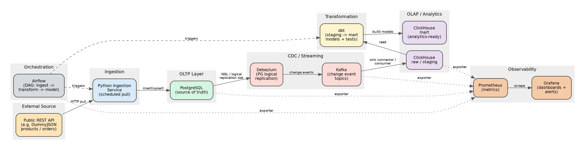

# End-to-End Analytics Engineering Pipeline

An analytics engineering pipeline that ingests data from a public REST API,
replicates it into ClickHouse in near real time via Debezium CDC, and
transforms it into analytics-ready and ML-ready datasets with dbt.

> Worked example: a products/orders REST API (e.g. DummyJSON) is used as the
> upstream source. Swap `ingestion/config.yaml` to point at a different public
> API with a comparable entity shape.

## Architecture

```
REST API -> Ingestion (Python) -> PostgreSQL (OLTP)
   -> Debezium (CDC) -> Kafka -> ClickHouse (raw/staging)
   -> dbt (staging -> mart) -> ClickHouse (mart)
Airflow orchestrates ingestion + dbt. Prometheus/Grafana observe every layer.
```

See `docs/design_report.docx` for the full architecture diagram, schema
documentation (ERD), observability design, and scaling notes.

## Prerequisites

- Docker and Docker Compose (v2+)
- 8GB+ RAM available to Docker (Kafka + ClickHouse + Postgres + Airflow together are memory-hungry)
- Ports free on the host: `5432` (Postgres), `9092` (Kafka), `8123`/`9000` (ClickHouse), `8080` (Airflow), `9090` (Prometheus), `3000` (Grafana)
- A GitHub repository (for the CI/CD workflow to run on push/PR)

## Running the Pipeline End-to-End

Everything starts with a single command:

```bash
cp .env.example .env
docker compose up -d --build
```

This brings up, in dependency order:

1. `postgres` — OLTP database, with logical replication enabled (`wal_level=logical`)
2. `zookeeper` + `kafka` — event streaming backbone
3. `debezium` (Kafka Connect + Debezium Postgres connector) — registers a connector against `postgres` on first boot via `debezium/register-connector.sh`
4. `clickhouse` — OLAP store, with `raw` and `mart` databases created from `clickhouse/init/`
5. `pushgateway` — receives short-lived ingestion/dbt metrics so successful DAG runs remain observable after their task containers exit
6. `airflow-init`, `airflow-webserver`, `airflow-scheduler` — orchestration; Airflow executes the ingestion code directly from the mounted `/opt/ingestion` source, so it does not require access to the host Docker socket
7. `prometheus` + `grafana` — observability, with dashboards auto-provisioned from `observability/grafana/dashboards/`

Startup takes 2–3 minutes on first run (image pulls + Airflow DB init). Check
everything is healthy with:

```bash
docker compose ps
```

All services should show `healthy` or `running`.

## Validating Data Moved Through Each Stage

| Stage | How to check |
|---|---|
| API → Postgres | `docker compose exec postgres psql -U pipeline -d pipeline -c "select count(*) from public.products;"` — should be non-zero after the first ingestion DAG run |
| Postgres → Debezium/Kafka | `docker compose exec kafka kafka-console-consumer --bootstrap-server kafka:9092 --topic pipeline.public.products --from-beginning --max-messages 5` — should print change events as JSON |
| Kafka → ClickHouse raw | `docker compose exec clickhouse clickhouse-client -q "select count(*) from raw.products"` |
| Raw → staging/mart (dbt) | The `analytics_pipeline` DAG runs `dbt build` then `dbt test`; manually: `docker compose exec airflow-scheduler bash -lc "cd /opt/dbt && dbt build --profiles-dir /opt/dbt"` |
| End-to-end freshness | Grafana → "Pipeline Health" → *Data Freshness*; ingestion metrics are pushed to Pushgateway after each resource run |

## Data Source

- Source: `<public REST API base URL, e.g. https://dummyjson.com/products>`
- Authentication: none required for the example API. If you swap in an
  API that requires a key, set `API_KEY` in `.env` (see `.env.example`) —
  it's injected into the ingestion container and never committed.
- Rate limits: the ingestion service respects the source API's documented
  rate limit via a configurable `REQUESTS_PER_MINUTE` setting in
  `ingestion/config.yaml`.

## Accessing Each Component

| Component | URL / connection | Credentials |
|---|---|---|
| Airflow UI | http://localhost:8080 | `admin` / see `.env` (`AIRFLOW_ADMIN_PASSWORD`) |
| ClickHouse (HTTP) | http://localhost:8123/play | `default` / see `.env` (`CLICKHOUSE_PASSWORD`) |
| ClickHouse (native client) | `docker compose exec clickhouse clickhouse-client` | — |
| PostgreSQL | `localhost:5432`, db `pipeline` | see `.env` (`POSTGRES_USER` / `POSTGRES_PASSWORD`) |
| Kafka | `localhost:9092` | — (no auth in local/dev compose) |
| Prometheus | http://localhost:9090 | — |
| Grafana | http://localhost:3000 | `admin` / see `.env` (`GRAFANA_ADMIN_PASSWORD`) |

Never commit `.env` — copy `.env.example` to `.env` and fill in local values.

## CI/CD

The GitHub Actions workflow (`.github/workflows/ci.yml`) triggers on every
push and pull request against `main` and runs:

1. **Lint** — `ruff`/`black` on the ingestion service, `sqlfluff` on dbt models
2. **Unit tests** — `pytest` against the ingestion service (mocked API responses)
3. **dbt build + test** — spins up an ephemeral Postgres + ClickHouse via
   `docker compose -f docker-compose.ci.yml`, runs `dbt build` and `dbt test`
   against them, and fails the pipeline if any test fails
4. **Image build** — builds and tags the ingestion service Docker image on `main`. Registry publishing is intentionally disabled until registry credentials are configured.

Pull requests are blocked by linting, unit tests, and dbt build/tests. The ingestion image is additionally built on pushes to `main`. SQLFluff is a hard CI gate rather than an advisory check.

## Repository Layout

```
.
├── docker-compose.yml
├── .env.example
├── ingestion/            # Python REST API ingestion service
├── debezium/             # Debezium connector config + registration script
├── clickhouse/init/      # Raw/mart database + table DDL
├── dbt/                  # staging + mart models, tests, sources.yml
├── airflow/dags/         # ingestion -> dbt orchestration DAG
├── observability/        # Prometheus config + Grafana dashboards/provisioning
├── docs/
│   └── design_report.docx
└── .github/workflows/ci.yml
```

## Pipeline correctness

- Order-line IDs are deterministic (`cart_id:product_id`), so repeated API pulls do not renumber existing facts.
- `order_ts` is immutable after first insert; source re-polls update quantity/user data without changing the original ingestion timestamp.
- ClickHouse CDC parsing explicitly handles Debezium `after=null` delete events by reading `before`.
- Airflow waits for Kafka exporter-reported ClickHouse consumer lag to reach zero instead of treating Debezium connector health as proof that ClickHouse has caught up.
- dbt tests enforce product referential integrity for facts and fail the DAG on data-quality regressions.

## Stopping / Resetting

```bash
docker compose down          # stop, keep volumes (data persists)
docker compose down -v       # stop and wipe all data — start clean
docker ps -a --filter "name=pipeline" --format "{{.ID}} {{.Names}}" | \
awk '{print $1}' | xargs -r docker rm -f #stubbon ones
```
