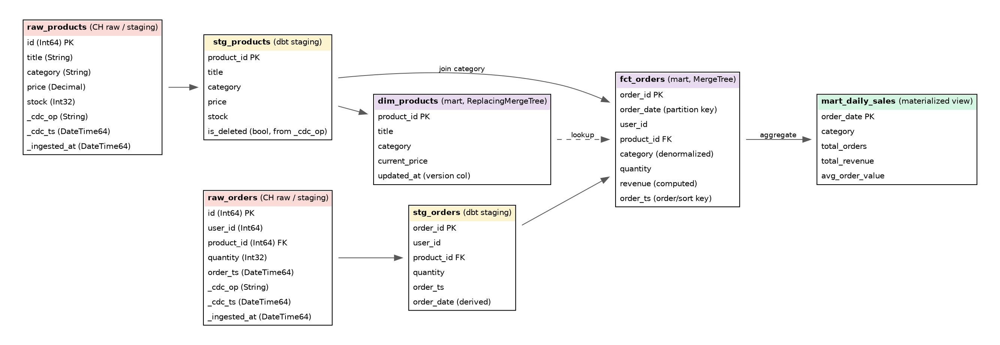

**DESIGN REPORT**

End-to-End Analytics Engineering Data Pipeline

Eric Ondenyi · Data Engineer

**1. Overview**

This report documents the design of an end-to-end analytics engineering
pipeline that ingests data from a public REST API, lands it in a
PostgreSQL OLTP layer, replicates changes in near real time into
ClickHouse via Debezium change data capture (CDC), and transforms raw
events into clean, analytics-ready and ML-ready datasets using layered
dbt models (staging → mart). Airflow orchestrates the complete workflow
without requiring access to the host Docker socket. Short-lived
ingestion and dbt failure/success metrics are persisted through
Prometheus Pushgateway and scraped by Prometheus/Grafana.

Worked example used throughout this report: a public products/orders
REST API (e.g. DummyJSON) is treated as an upstream e-commerce system.
Products and cart line items are pulled into PostgreSQL. Each order-line
key is deterministic (cart_id:product_id), making repeated API pulls
idempotent and preventing row renumbering. Downstream consumers query
ClickHouse for near-real-time sales and inventory analytics.

**2. Architecture Diagram**

{width="6.5in"
height="1.6666666666666667in"}

*Figure 1. End-to-end architecture: ingestion → OLTP → CDC → OLAP →
transformation, with orchestration and observability spanning every
layer.*

**2.1 Component Rationale**

  --------------------- -------------------------------------------------
  **Component**         **Why this choice**

  **Ingestion service** A small Python service polls the public REST API
                        on a schedule and upserts records into
                        PostgreSQL. Kept outside Airflow\'s own executor
                        so it can be retried/scaled independently;
                        Airflow only triggers and monitors it.

  **PostgreSQL (OLTP)** Acts as the system of record and the CDC source.
                        Chosen over ingesting straight into ClickHouse
                        because it gives transactional upserts,
                        constraints, and a stable WAL for Debezium to
                        read --- ClickHouse is not designed for row-level
                        upserts at ingestion time.

  **Debezium**          Reads PostgreSQL\'s write-ahead log via logical
                        replication and emits row-level change events
                        (insert/update/delete) with before/after state
                        --- this is what makes replication "near real
                        time" rather than batch-polled.

  **Kafka**             Durable, replayable buffer between Debezium and
                        ClickHouse. Decouples produce and consume rates,
                        and allows the ClickHouse sink (or a consumer) to
                        reprocess a topic from any offset if a downstream
                        schema changes.

  **ClickHouse          Change events land largely as-is (append-only,
  (raw/staging)**       including the CDC operation type and timestamp)
                        so the raw layer is a faithful, replayable copy
                        of upstream changes --- nothing is thrown away
                        before staging.

  **dbt**               Owns all business logic: staging models
                        standardize types and flag deletes; mart models
                        denormalize, aggregate, and apply
                        ClickHouse-specific physical design. dbt tests
                        enforce not-null/uniqueness/referential checks at
                        each layer boundary.

  **ClickHouse (mart)** Analytics-ready tables and materialized views,
                        modeled specifically for ClickHouse\'s MergeTree
                        family rather than a generic star schema --- see
                        §3 for engine/partition/order choices.

  **Airflow**           Orchestrates the full path (ingest → wait for CDC
                        lag to settle → dbt run → dbt test) as a single
                        DAG with clear task-level retries and SLAs.

  **Prometheus /        Exporters on Postgres, Kafka, ClickHouse and
  Grafana**             Airflow feed Prometheus; Grafana dashboards and
                        alert rules surface pipeline health, CDC lag, and
                        data freshness in one place (see §4).
  --------------------- -------------------------------------------------

**3. Data Model / Schema**

The schema follows a strict staging → mart layering. Raw CDC events are
never queried directly by consumers; every analytics-facing table is
built by dbt.

{width="6.5in"
height="2.25in"}

*Figure 2. Schema flow from raw CDC tables through dbt staging models
into ClickHouse mart tables and a pre-aggregated materialized view.*

**3.1 Layer Definitions**

-   raw\_\* (ClickHouse, MergeTree, append-only): one row per CDC event,
    including \_cdc_op (insert/update/delete) and \_cdc_ts. Nothing is
    overwritten --- this layer is the audit trail and replay source.
    Debezium delete events are explicitly parsed from the before image
    when after is null.

-   stg\_\* (dbt staging models, views): type casting, column renaming,
    and collapsing CDC history down to current-row semantics (is_deleted
    flags, latest-value resolution).

-   dim\_ / fct\_ (dbt mart models, ClickHouse tables): denormalized,
    business-facing tables optimized for the query patterns analysts and
    ML feature pipelines actually run (filter by date, group by
    category). Product dimensions use MergeTree because dbt already
    supplies a single latest row per product.

-   mart_daily_sales (dbt aggregate table using SummingMergeTree): a
    pre-aggregated rollup so dashboards do not scan fct_orders on every
    load. The current reference implementation intentionally rebuilds
    this compact aggregate during dbt runs.

**3.2 ClickHouse-Specific Design Choices**

  --------------------- -------------------------------------------------
  **Decision**          **Rationale**

  **Table engine ---    MergeTree. Standard choice for large,
  fct_orders**          append-heavy fact data with no need for the
                        last-write-wins semantics ReplacingMergeTree
                        provides.

  **Table engine ---    ReplacingMergeTree(updated_at). Products get
  dim_products**        updated in place upstream; this engine keeps only
                        the latest version per product_id on merge,
                        matching dimension-table semantics without manual
                        dedup logic.

  **Partition key ---   toYYYYMM(order_date). Keeps partitions to a
  fct_orders**          manageable size for a table that grows daily, and
                        lets ClickHouse prune whole months for
                        date-ranged queries.

  **Order/sort key ---  (order_date, category, order_id). Matches the
  fct_orders**          dominant query shape (date-ranged,
                        category-filtered aggregation) so ClickHouse can
                        skip granules instead of scanning the full
                        partition.

  **Materialized view   Built with AggregatingMergeTree-style incremental
  ---                   aggregation so dashboard queries hit a small
  mart_daily_sales**    pre-aggregated table instead of re-scanning
                        fct_orders on every request.

  **Raw layer engine**  MergeTree ordered by (\_cdc_ts), append-only.
                        Optimized for high-throughput sequential writes
                        from the Kafka consumer, not for point lookups.
  --------------------- -------------------------------------------------

**4. Observability Design**

Observability spans both platform health (are the systems up and keeping
pace) and data health (is the data itself trustworthy and fresh). Both
are treated as first-class, not an afterthought bolted on at the end.

**4.1 What Is Monitored**

  --------------------- -------------------------------------------------
  **Signal**            **What\'s tracked**

  **Pipeline health**   Airflow task success/failure rate, task duration
                        trend, DAG run SLA misses (via the Airflow
                        StatsD/Prometheus exporter).

  **CDC lag**           Debezium connector lag metrics (source offset vs.
                        last committed offset) and Kafka consumer group
                        lag on the CDC topics --- the leading indicator
                        that "near real time" is actually being met.

  **Data freshness**    Max(\_ingested_at) / max(\_cdc_ts) per raw table,
                        exposed as a custom metric and alerted on if it
                        exceeds an expected staleness threshold (e.g. no
                        new events in 15 minutes during business hours).

  **Data quality**      dbt test pass/fail counts per run (not-null,
                        uniqueness, relationships, accepted-values),
                        surfaced as a Prometheus metric via a small
                        dbt-artifacts exporter so failing tests show up
                        on the same dashboard as infra metrics, not
                        buried in CI logs.

  **Resource usage**    Postgres connection count and replication slot
                        lag, Kafka broker disk/throughput, ClickHouse
                        query latency and merge/part counts, container
                        CPU/memory via cAdvisor.
  --------------------- -------------------------------------------------

**4.2 Tooling Choice**

Prometheus + Grafana were chosen because every major platform component
in this stack exposes mature metrics or has an exporter. Pushgateway is
used only for short-lived batch metrics from ingestion and dbt tasks,
avoiding the incorrect assumption that an exited task container can
remain scrapeable. Monitoring includes API ingestion success/failure and
row counts, Kafka consumer lag, PostgreSQL replication-slot health,
ClickHouse metrics, and Airflow task/DAG metrics. The Airflow CDC sensor
reads Kafka exporter metrics and waits for the ClickHouse consumer
groups to report zero lag before dbt executes.

**5. Scaling & Extension**

  --------------------- -------------------------------------------------
  **Growth vector**     **How the design extends**

  **Ingestion           Move from a single scheduled poller to a fan-out
  throughput**          of paginated/parallel API workers, or switch the
                        source system to push webhooks where the API
                        supports them, removing polling latency entirely.

  **CDC / Kafka         Increase Kafka topic partitions and consumer
  throughput**          parallelism; scale Debezium via Kafka Connect\'s
                        distributed mode instead of a single connector
                        instance.

  **ClickHouse write    Move from single-node to a ClickHouse cluster
  volume**              with sharding (by a hash of order_id or user_id)
                        and replication; introduce a buffer table or
                        Kafka engine table in front of MergeTree to
                        smooth write bursts.

  **Query volume /      Add more materialized views for the next tier of
  concurrency**         dashboard queries as they emerge; consider a
                        read-replica shard group so heavy ad-hoc analyst
                        queries don\'t compete with the ingestion path.

  **Orchestration       As more sources are added, split into per-source
  complexity**          DAGs with clear dependency sensors rather than
                        one monolithic DAG, and move shared logic into
                        Airflow task groups or custom operators.

  **Schema evolution**  Introduce a schema registry (e.g. for
                        Kafka/Debezium\'s Avro or JSON schema support) so
                        upstream schema changes fail fast and visibly
                        instead of silently breaking dbt models
                        downstream.
  --------------------- -------------------------------------------------
